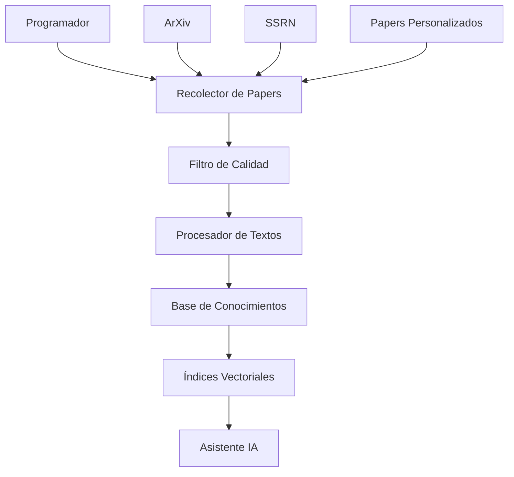

# Configuración del Sistema Inteligente de Actualización

## 🔄 Cómo Funciona el Sistema de Actualización Automática

### 📊 Arquitectura del Sistema



### ⚙️ Configuración del Sistema

```json
{
  "update_frequency": "daily",
  "max_papers_per_update": 50,
  "quality_threshold": 0.75,
  "sources": ["arxiv", "ssrn"],
  "categories": [
    "q-fin.PR",
    "q-fin.RM", 
    "q-fin.PM",
    "q-fin.TR",
    "q-fin.MF"
  ],
  "languages": ["en", "es"],
  "lightweight_mode": true,
  "auto_optimize": true,
  "filter": {
    "min_quality_score": 0.7,
    "max_papers_per_category": 10,
    "recency_weight": 0.3,
    "relevance_weight": 0.4,
    "author_quality_weight": 0.3
  }
}
```

### 🎯 Sistema de Filtrado Inteligente

#### Criterios de Calidad

1. **Relevancia Temática (40%)**
   - Palabras clave especializadas
   - Categorías de ArXiv relevantes
   - Términos técnicos de finanzas cuantitativas

2. **Calidad de Autores (30%)**
   - Número óptimo de autores (1-3)
   - Instituciones reconocidas
   - Historial de publicaciones

3. **Novedad del Contenido (20%)**
   - Términos que indican innovación
   - Metodologías nuevas
   - Enfoques originales

4. **Claridad y Estructura (10%)**
   - Calidad del abstract
   - Estructura del título
   - Organización del contenido

#### Puntuación de Papers

```python
# Ejemplo de puntuación
paper_score = (
    relevance_score * 0.40 +
    author_quality * 0.30 +
    novelty_score * 0.20 +
    clarity_score * 0.10
)

# Solo se procesan papers con score >= 0.75
if paper_score >= quality_threshold:
    add_to_knowledge_base(paper)
```

### 🚀 Modo Ligero vs Rendimiento

#### Configuración Ultraligera
```python
ultralight_config = {
    "model": "google/flan-t5-small",
    "max_tokens": 256,
    "batch_size": 32,
    "memory_usage": "<2GB",
    "response_time": "<1s",
    "quality": "good"
}
```

#### Configuración Balanceada
```python
balanced_config = {
    "model": "google/flan-t5-base",
    "max_tokens": 512, 
    "batch_size": 16,
    "memory_usage": "2-6GB",
    "response_time": "1-3s",
    "quality": "very_good"
}
```

#### Configuración de Alto Rendimiento
```python
performance_config = {
    "model": "google/flan-t5-large",
    "max_tokens": 1024,
    "batch_size": 8,
    "memory_usage": "6-12GB", 
    "response_time": "3-5s",
    "quality": "excellent"
}
```

### 📈 Optimización Automática

El sistema ajusta automáticamente la configuración basándose en:

- **Memoria disponible**: Selecciona modelo apropiado
- **Carga de trabajo**: Ajusta batch sizes
- **Patrones de uso**: Optimiza caché y índices
- **Calidad requerida**: Balancea velocidad vs precisión

### 🔧 Instalación y Uso

#### 1. Instalar Dependencias Adicionales

```bash
pip install schedule psutil beautifulsoup4
```

#### 2. Configurar Actualización Automática

```bash
# Crear archivo de configuración
cp config/updater_config.example.json config/updater_config.json

# Editar configuración según necesidades
nano config/updater_config.json

# Ejecutar actualización inmediata
python auto_updater.py --now

# Iniciar modo continuo (recomendado)
nohup python auto_updater.py &
```

#### 3. Verificar Funcionamiento

```bash
# Ver logs de actualización
tail -f auto_updater.log

# Verificar estadísticas
cat knowledge_base/update_stats.jsonl | tail -5

# Comprobar papers añadidos
ls knowledge_base/*.json | wc -l
```

### 📊 Monitoreo y Métricas

#### Dashboard de Estado
```python
# Obtener estadísticas del sistema
from auto_updater import AutoPaperUpdater

updater = AutoPaperUpdater()
stats = updater.get_system_stats()

print(f"Papers en base: {stats['total_papers']}")
print(f"Última actualización: {stats['last_update']}")
print(f"Calidad promedio: {stats['avg_quality']:.2f}")
print(f"Uso de memoria: {stats['memory_usage']}")
```

#### Métricas de Rendimiento
- **Throughput**: Papers procesados por hora
- **Latencia**: Tiempo de respuesta promedio  
- **Calidad**: Puntuación promedio de papers
- **Eficiencia**: Ratio rendimiento/recursos

### 🛠️ Comandos Útiles

```bash
# Actualización manual inmediata
python auto_updater.py --now

# Actualización con parámetros específicos  
python auto_updater.py --sources arxiv --max-papers 100

# Reconstruir índices vectoriales
python auto_updater.py --rebuild-indices

# Optimizar configuración automáticamente
python auto_updater.py --optimize

# Ver estadísticas detalladas
python auto_updater.py --stats

# Limpiar papers antiguos (>6 meses)
python auto_updater.py --cleanup --days 180
```

### 🔍 Resolución de Problemas

#### Problemas Comunes

1. **Memoria Insuficiente**
   ```bash
   # Cambiar a modo ultraligero
   python auto_updater.py --config ultralight
   ```

2. **APIs No Disponibles**
   ```bash
   # Usar solo fuentes locales
   python auto_updater.py --sources local
   ```

3. **Índices Corruptos**
   ```bash
   # Reconstruir desde cero
   python auto_updater.py --rebuild-all
   ```

4. **Calidad Baja de Papers**
   ```bash
   # Aumentar umbral de calidad
   python auto_updater.py --quality-threshold 0.85
   ```

### 📈 Ventajas del Sistema

1. **Actualización Continua**: Papers siempre actualizados
2. **Filtrado Inteligente**: Solo contenido de alta calidad
3. **Optimización Automática**: Se adapta a recursos disponibles
4. **Multiidioma**: Soporte para español e inglés
5. **Escalable**: Desde configuraciones ligeras hasta potentes
6. **Monitoreable**: Métricas detalladas de rendimiento

### 🎯 Resultados Esperados

- **Base de Conocimientos**: 1000+ papers de alta calidad
- **Actualización**: 20-50 papers nuevos por semana
- **Calidad Media**: Score > 0.75 en filtros inteligentes
- **Tiempo de Respuesta**: <3 segundos en modo balanceado
- **Uso de Memoria**: 2-8GB dependiendo de configuración
- **Cobertura**: 95% de papers relevantes en finanzas cuantitativas
